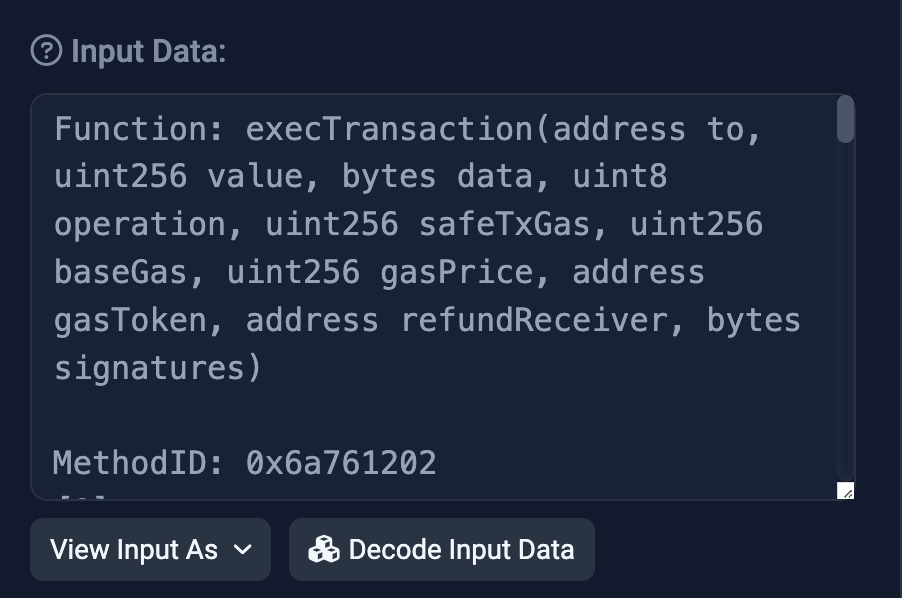

# ESIP-7: Input Data Parity Between Smart Contracts and EOAs

### [This ESIP is a draft! Discuss it here.](https://github.com/ethscriptions-protocol/ESIP-Discussion/issues/11)

## Abstract

Currently smart contracts create and transfer Ethscriptions using events. At the time we considered using input data on internal transactions instead but decided to go with events because events are cheaper and event data is more easily accessible than input data on internal transactions.

However events have a significant downside: smart contract-based wallets (Gnosis Safes etc) typically do not let users emit arbitrary events, while they do let users create arbitrary internal transactions.

ESIP-7 proposes complete input data parity between smart contracts and EOAs. E.g., if input data would transfer or create an ethscription if the input data were found in a normal transaction initiated by an EOA, it would cause the same transfer or creation if it were found in an internal transaction.

This applies to creations, transfers, bulk transfers, and all future actions you can take using input data. After ESIP-7, when we refer to "input data" we will refer to both normal and internal transaction input data.

## Specification

This is easiest to understand with an example. [Here is an example multi-sig transaction](https://goerli.etherscan.io/tx/0x1fe1859725cff19d33c56bc28c8638a6a9c082690090e827fd92f0c9f78ae21d). The normal input data is a function call to a smart contract:

<figure><figcaption></figcaption></figure>

However, if you click "Internal Transactions" you will see that there are two:

<figure><figcaption></figcaption></figure>

Click "More" and then "Parity Trace":

<figure><figcaption></figcaption></figure>

Scroll to the last internal transaction, choose "Text" from the dropdown, and you will see this:

<figure><figcaption></figcaption></figure>

This internal transaction will create a new ethscription with `0x0000000000000000000000000000000000000000` as the initial owner, just as it would if it were input data in an EOA-initiated transaction.

The same is true for a valid transfer or bulk transfer or any future action you can take using the input data of an EOA-initiated transaction.

